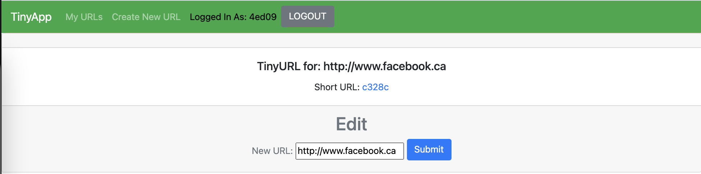
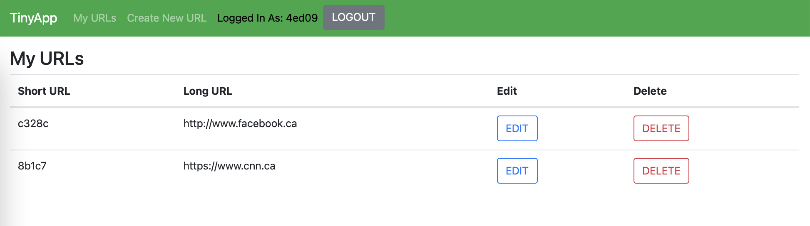
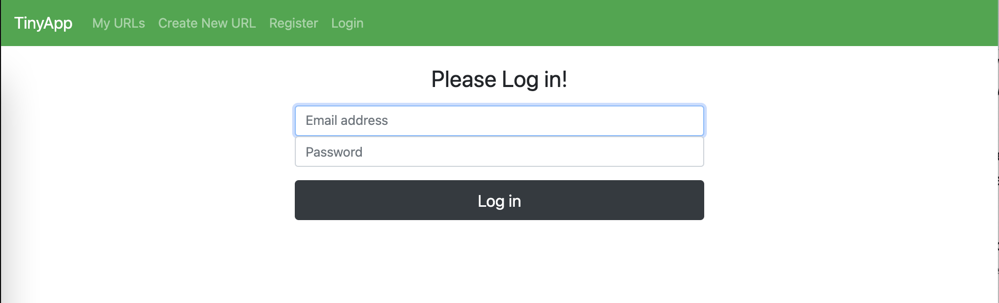
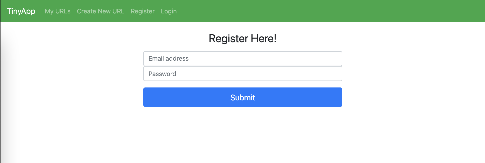
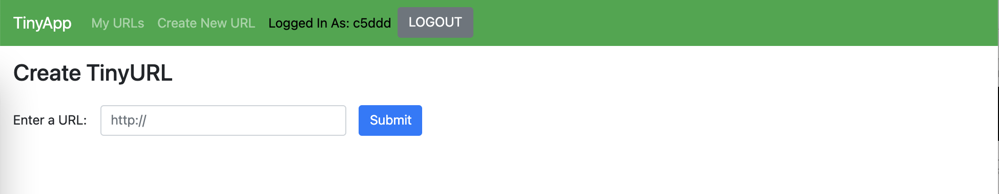

# TinyApp Project

TinyApp is a full stack web application built with Node and Express that allows users to shorten long URLs (à la bit.ly).

I was asked to build an HTTP Server that handles requests from the browser. Along the way I was introduced to some more advanced JavaScript and Node concepts, and I also learned more about Express and EJS.

[Here is the link to the deployed server on heroku](https://young-lake-90503.herokuapp.com/register)

## Final Product

## Dependencies

- Node.js
- Express
- EJS
- bcrypt
- body-parser
- cookie-session

## Getting Started

- Install all dependencies (using the `npm install` command).
- Run the development web server using the `npm start` command.
